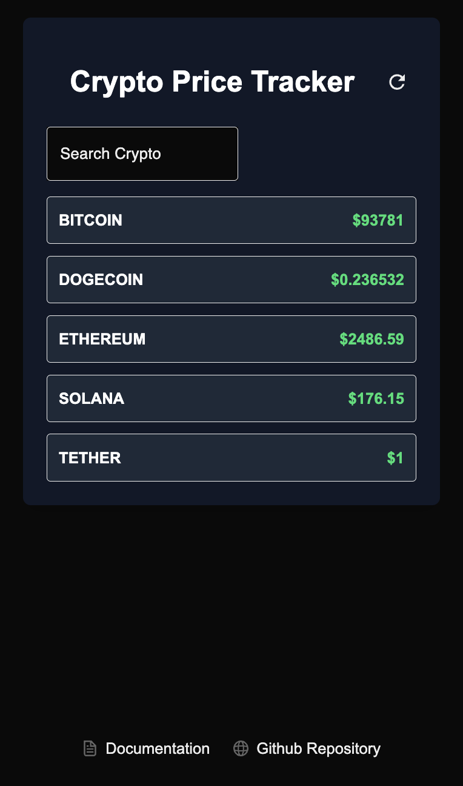

# Crptocurrency Dashboard

A simple cryptocurrency price tracker that fetches live data from a public API and displays real-time prices. The project consists of:
- A Next.js Web App for tracking cryptocurrency prices.
- A Docusaurus Documentation Page explaining the development approach.



## How to Set up the project

1. Clone the repository
```bash
git clone https://github.com/your-username/crypto-price-tracker.git
cd crypto-price-tracker
```

2. install dependencies
```bash
npm install
```

3. start the dev server
```bash
npm run dev
```

### How to view responsiveness on mobile device
- Right click on the page to enter the inspection panel
- Click on the top left "toggle device toolbar" icon to view on other smaller dimensions

## API Integration

### API source
- Coingecko
```
"https://api.coingecko.com/api/v3/simple/price?ids=bitcoin,ethereum,tether,dogecoin,solana&vs_currencies=usd&include_last_updated_at=true&include_24hr_change=true"
```
### How API was fetched
- The API request is handled using Axios inside fetchData.js
- The data is automatically cached and refetched using React Query.

### Why React Query?
- React Query allows for automatic cacheing, background refetching, and also built-in api calls
- It ensures it doesn't overfetch

## Challenges Faced
1. Next.js App Router vs old page router
- I was used to page router, and not the latest app router next.js is using, but I wanted to practice the latest change as well, so I gave it a shot at using it.
- I wasn't aware that Next.js App Router makes components Server Components by default, so it took me a while to figure out that I can't add QueryClientProvider to a server component
- **Solution**: I was able to figure out to create a separate client component to wrap my QueryClientProvider than adding the client component to my page.js (server component)

2. Apart from working on the Next.js app, this was my first encounter with Docusaurus, so I had to read through its documentation to gain a better understanding of it.
   
